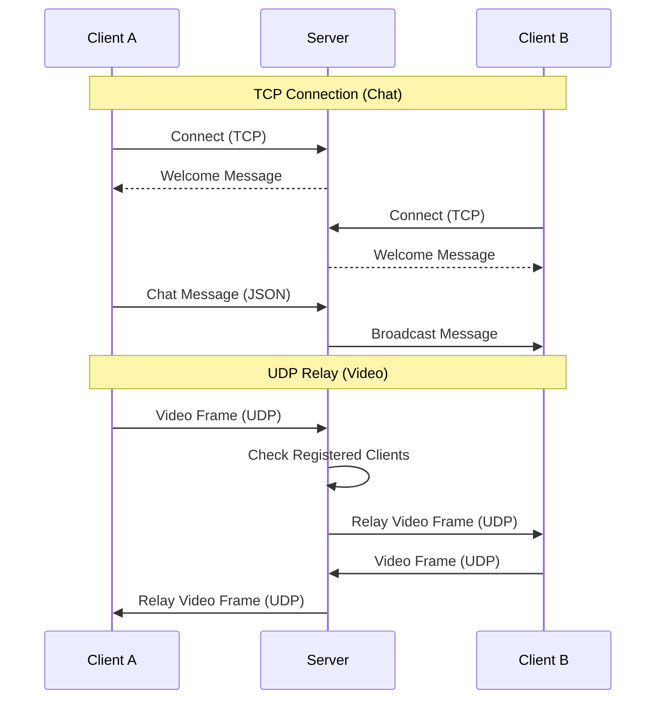

# Simple Chat & Video Relay Server

## 프로젝트 개요
Winsock을 활용하여 구현한 실시간 채팅 및 비디오 스트리밍 릴레이 서버입니다. C++ 기반의 서버와 안드로이드 클라이언트로 구성되어 있으며, TCP를 이용한 텍스트 통신과 UDP를 이용한 영상 데이터 중계를 수행합니다.

## 기술 스택
* **Server**: C++ (Winsock2), MSVC
* **Client**: Android (Kotlin)
* **Protocol**: TCP (Chat), UDP (Video Relay)
* **Data Format**: JSON

## 시스템 아키텍처

### 통신 흐름도


## 핵심 로직 및 처리 방식

### 1. I/O Multiplexing (Select 모델)
단일 스레드에서 다수의 클라이언트 요청을 효율적으로 처리하기 위해 `select` 모델을 채택하였습니다.
* `FD_SET`을 통해 서버 소켓(TCP/UDP)과 연결된 모든 클라이언트 소켓을 감시합니다.
* `select` 함수가 소켓의 상태 변화를 감지하면, 순차적으로 읽기 이벤트를 처리합니다.
    * **UDP 소켓**: 데이터 수신 시, 송신자를 제외한 등록된 모든 클라이언트에게 데이터를 즉시 전달(Relay)합니다.
    * **TCP 리스닝 소켓**: 새로운 연결 요청(`accept`)을 처리하고 클라이언트 목록에 추가합니다.
    * **TCP 클라이언트 소켓**: 클라이언트의 메시지를 수신하여 JSON 파싱 후 다른 클라이언트들에게 브로드캐스트합니다.

### 2. 클라이언트 관리 (UDP)
UDP는 비연결성 프로토콜이므로, 별도의 클라이언트 등록 로직을 구현하였습니다.
* 최초 데이터 수신 시 IP와 Port 정보를 `udp_clients` 목록에 저장합니다.
* 이후 수신되는 패킷은 송신자를 제외한 목록 내 모든 대상에게 전송합니다.

### 3. 데이터 프로토콜
채팅 데이터는 확장성을 고려하여 JSON 형식을 사용합니다.
* `server_win.cpp`와 `chatPacket.h`에서 메시지를 직렬화하여 전송합니다.
* 메시지 타입(`system`, `client`)에 따라 클라이언트에서 UI를 다르게 표시할 수 있도록 구조화하였습니다.

## 프로젝트 구조

```text
WebSocketServer/
├── chat-server/           # 서버 소스 코드
│   ├── server_win.cpp     # 메인 서버 로직 (Winsock 초기화, Select 루프)
│   ├── chatPacket.h       # JSON 메시지 포맷팅 및 문자열 처리 헤더
│   └── chat-schema.json   # 채팅 메시지 JSON 스키마 명세
└── android-client/        # 안드로이드 클라이언트
    └── app/src/main/      # 앱 주요 소스 (UI, 소켓 통신)
```

## 실행 화면
https://github.com/user-attachments/assets/2e3b8113-4fd8-4e5e-be85-e4fb5e318b90


## AI Assistant
이 프로젝트는 **Antigravity**와 함께 작업되었습니다. 

